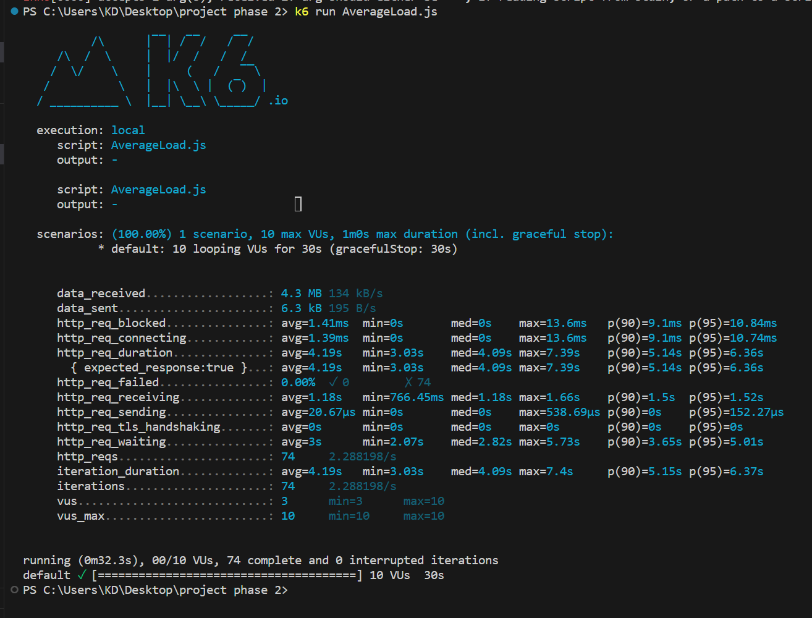
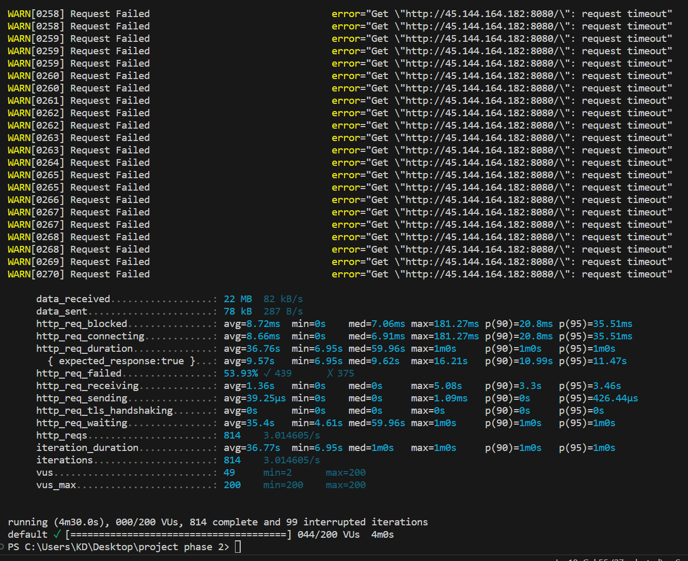
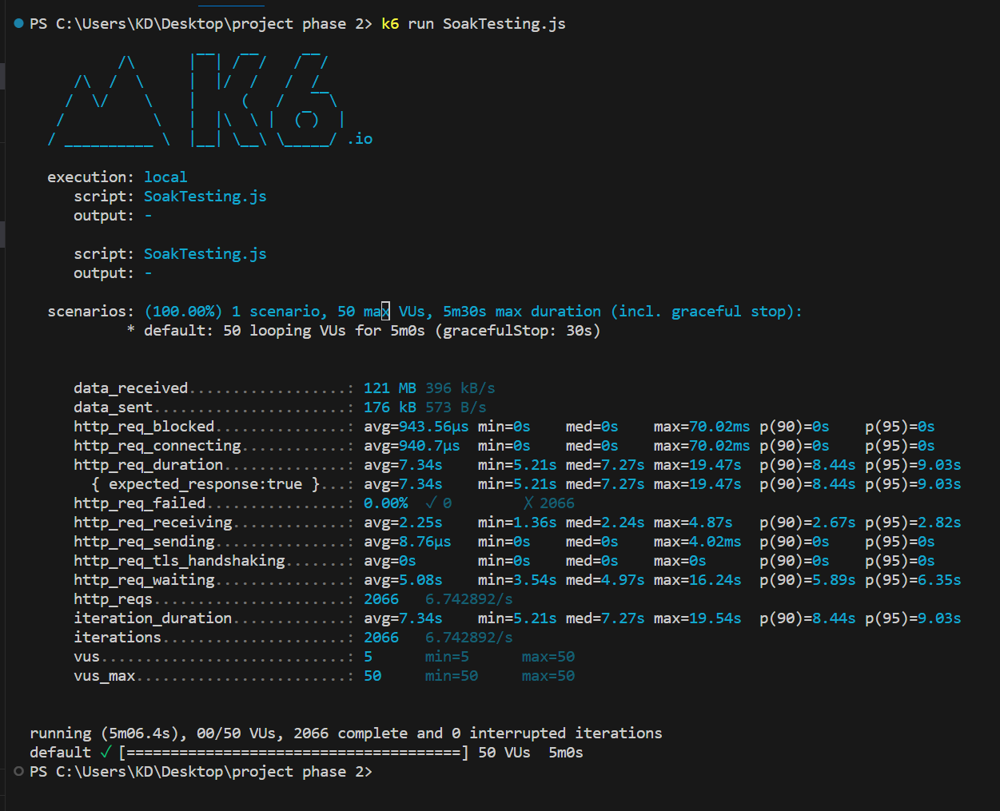
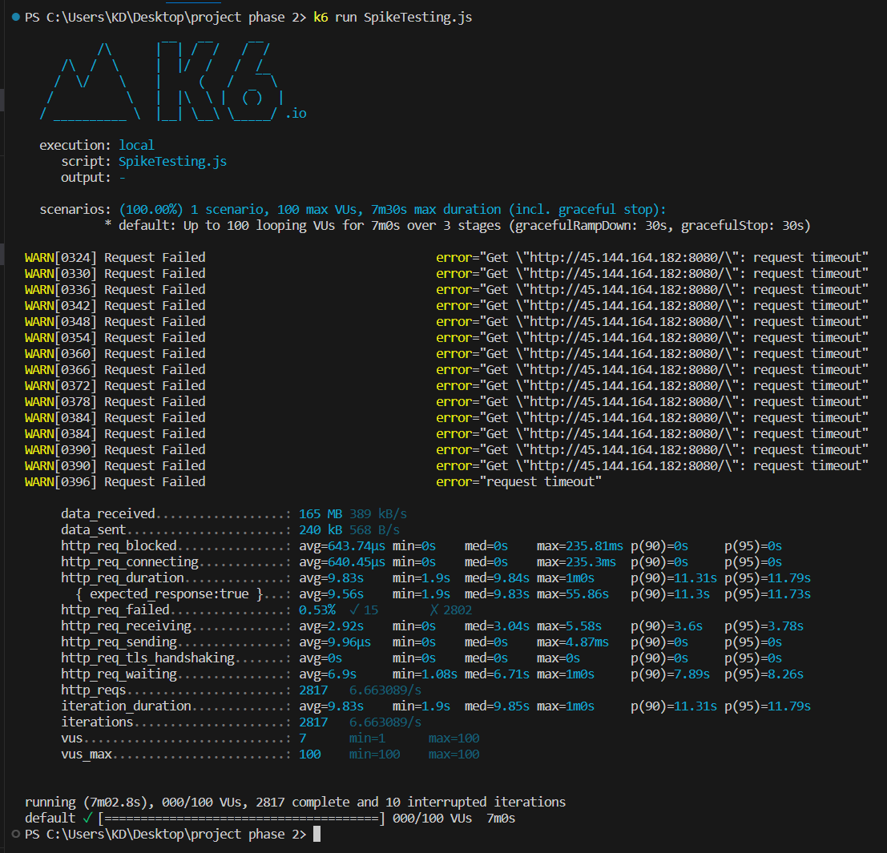

# ITDS362 Project Assignment 2 #
## System testing, Automated UI testing, and performance testing ##
### Project Name: Retailsy
### Group 2 
 
#### 6487015 Jarasporn Konta
#### 6487025 yanathip jaroenjan
#### 6487040 Naruebet Phonsin
#### 6487072 Kamolluck Udompaiboonlarp
#### 6487073 Kullatida Jangsawat
#### 6487074 Kullanipa Jangsawat

# System testing #
## Test Case 1

**Test Case ID** : T01	

**Module Name** : Add to cart	

**Test Title** : Add product to cart

**Description** : Add a product that user choose to cart 

**Test Priority (Low/Medium/High)** : Med	

**Test Designed by** : Yanathip Jaroenjan

**Test Designed date** : 18/11/2023

**Test Executed by** : Jarasporn Konta

**Test Execution date** : 18/11/2023

> Pre-conditions : User need to know what do they want 

>Dependencies : 

step | Test Steps | Test Data | Expexted Result | Actual Result | Status | Comments |
-----|------------|-----------|-----------------|---------------|--------|----------|
1  |  Open Browser http://45.144.164.182:8080/ | |                |  | Pass |          
2  | Click microphone  |  | Systems should show microphone product list |  Systems show microphone product list | Pass |          |
3  | Click HYPERX DUOCAST USB (BLACK) | | Systems should show product details HYPERX DUOCAST USB (BLACK) |   Systems show product details HYPERX DUOCAST USB (BLACK) | Pass |          |
4  | Click Add to Cart    |  | Systems should add product to cart |  Systems add product to cart| Pass |     
5  | Click icon cart   |  | Systems should show product in cart | Systems show product in cart| Pass |  

> Post-conditions : User can choose a product into a cart

## Test Case 2

**Test Case ID** : T02

**Module Name** : Search Products

**Test Title** : Search a product

**Description** : 	input a name of product for searc that product 

**Test Priority (Low/Medium/High)** : Med	

**Test Designed by** : Group2

**Test Designed date** : 18/11/2023

**Test Executed by** : Kamolluck Udompaiboonlarp

**Test Execution date** : 18/11/2023

> Pre-conditions : Name of Product
>Dependencies : 

step | Test Steps | Test Data | Expexted Result | Actual Result | Status | Comments |
-----|------------|-----------|-----------------|---------------|--------|----------|
1  |  Open Browser  http://45.144.164.182:8080/ | |                |  | Pass |          
2  | Click Search Field  | input "iPad" word to Search field | Systems should show Search field Corresponds to the input | Systems show Search field Corresponds to the input | Pass |          |
3  | Click Search  button  |  | Systems should show list product that about "iPad" | Systems show list product that about "iPad" | Pass | 

> Post-conditions : Systems show list of a product

## Test Case 3

**Test Case ID** : T03	

**Module Name** : Order Product

**Test Title** :  Can order product 

**Description** :  Can order product success by inputting address details

**Test Priority (Low/Medium/High)** : High	

**Test Designed by** : Yanathip Jaroenjan

**Test Designed date** : 18/11/2023

**Test Executed by** :  Kamolluck Udompaiboonlarp

**Test Execution date** : 18/11/2023

> Pre-conditions : Users need to know what address they want to ship to and the product they want to order

>Dependencies : 

step | Test Steps | Test Data | Expexted Result | Actual Result | Status | Comments |
-----|------------|-----------|-----------------|---------------|--------|----------|
1  | Open Browser http://45.144.164.182:8080/ | |                |  | Pass |          
2  | Click Uncategorized |  | Systems should show Uncategorized product list |  Systems show Uncategorized product list | Pass |          |
3  |Click Apple iPad mini Gen6/256GB/8.3/Wi-Fi/STARLIGHT | | Systems should show product details Apple iPad mini Gen6/256GB/8.3/Wi-Fi/STARLIGHT |  Systems show product details Apple iPad mini Gen6/256GB/8.3/Wi-Fi/STARLIGHT | Pass |          |
4  | Click button add to cart    |  | Systems should add iPad product to cart |  Systems add iPad product to cart| Pass |     
5  | Click Cart icon  |  | Systems should show detail product that choose into cart | Systems show details product that choose into cart  | Pass |  
6  | Click Checkout  |  | Systems should show address for shipping and detail your order  | Systems show address for shipping and detail your order | Pass |          |
7  | Input Information to fields | First name="Group2", Last name="DST", Country="Thailand", Street Address={"11/7 Street A", "Mahidol"}, Town/City="Nakonpathom", State/Country="Nakhon Pathom", Post Code/ZIP="1112", Phone="0112223345", Email address="Group2@gmail.com"| Add detail success | Add detail success | Pass |          |
8  | Click place Order button |  | Systems should show information shipping detail and order detail | Systems show information shipping detail  and order detail | Pass |     

> Post-conditions :  Users receive the correct product.

## Test Case 4

**Test Case ID** : T04

**Module Name** : Add detail address 

**Test Title** : Input detail address Not complete

**Description** : 	What happens when the detailed address is incomplete?

**Test Priority (Low/Medium/High)** : High

**Test Designed by** : Group2

**Test Designed date** : 18/11/2023

**Test Executed by** :  -

**Test Execution date** : -

> Pre-conditions :  Billing Data and Shipping Data

>Dependencies : 

step | Test Steps | Test Data | Expexted Result | Actual Result | Status | Comments |
-----|------------|-----------|-----------------|---------------|--------|----------|
1  | Open Browser http://45.144.164.182:8080/ | |                |  | Pass |          
2  | Click microphone  |  | Systems should show Product of microphone Category  | Systems show Product of microphone Category  | Pass |          |
3  | Click 'LOGITECH G YETI ORB RGB BLACK' of the name's Product | | Systems should show detail of LOGITECH G YETI ORB RGB BLACK's Product | Systems show detail of LOGITECH G YETI ORB RGB BLACK's Product | Pass |          |
4  |คลิกปุ่ม Add to Cart    |  | Systems should add product to cart | Systems add product to cart | Pass |     
5  |คลิก icon cart   |  | Systems should show list Product in cart | Systems show list Product in cart| Pass |  
6  | คลิกปุุ่ม View   |  | Systems should show list microphone Category | Systems show list microphone Category | Pass |          |
7  |คลิกปุ่ม Proceed to checkout | | Systems should show detail of LOGITECH G YETI ORB RGB BLACK Product |  Systems show detail of LOGITECH G YETI ORB RGB BLACK Product | Pass |          |
8  |ระบุข้อมูลตามฟิลด์ที่กำหนด | detail of information without street address | Systems should add product to cart | "Street address" Word change to red color| Fail |  

> Pre-conditions :  Billing Data and Shipping Data  

## Test Case 5

**Test Case ID** : T05

**Module Name** : Login

**Test Title** : Username/email address was entered incorrectly

**Description** : 	What happens when an incorrect username or email address is not being registered?

#**Test Priority (Low/Medium/High)** : Med

**Test Designed by** : Group2

**Test Designed date** : 18/11/2023

**Test Executed by** :  -

**Test Execution date** : -

> Pre-conditions : Username/email address and Password

>Dependencies : 

step | Test Steps | Test Data | Expexted Result | Actual Result | Status | Comments |
-----|------------|-----------|-----------------|---------------|--------|----------|
1  | Open Browser  http://45.144.164.182:8080/ | |                |  | Pass |          
2  | CLick Login icon  |  | Systems should show Login page | Systems show Login page | Pass |  
3  | input information to fields| Username="notRegTest", Password="@T05_PW" | The system should show a Username/email address field and the correct password  | The system show a Username/email address field and the correct password  | Pass |          |
4  | Cliclk Login button |  | Systems will show login page and back to Home page | System can not show login page and login page will show again | Fail |     

# UI testing # 
### Link VDO 

# Performance testing 
i. Average-load test

Performance ของ Average-load test ค่อนข้างช้า มี VUs 10 ระยะเวลาที่ต้องการทดสอบ 30s 

มีการส่ง request ไปทั้งหมด 74 request ระบบส่งข้อมูลตอบกลับให้ช้า ส่งไปประมาณ 20 คำขอ ระบบตอบกลับประมาณ 1 คำขอโดยเฉลี่ย

ii. Stress testing

Performance ของ Stress testing ค่อนข้างช้า มีเวลาในการรอการตอบกลับนาน มีการขัดจังหวะและมีข้อผิดพลาดเยอะ มี VUs 200 ระยะเวลาที่ต้องการทดสอบ 4m 

มีการส่ง request ไปทั้งหมด 814 request ระบบส่งข้อมูลตอบกลับให้ช้า ส่งไปประมาณ 39 คำขอ ระบบตอบกลับประมาณ 1 คำขอโดยเฉลี่ย และมีคำขอที่ล้มเหลว 439 คำขอ

iii. Soak testing

Performance ของ Soak testing ค่อนข้างช้า มี VUs 50 ระยะเวลาที่ต้องการทดสอบ 5m 

มีการส่ง request ไปทั้งหมด 2066 request ระบบส่งข้อมูลตอบกลับให้ช้า มีระยะเวลาในการรอส่ง request ประมาณ 5s ต่อคำขอ

iv. Spike testing

Performance ของ Soak testing ค่อนข้างช้า มี VUs 100 ระยะเวลาที่ต้องการทดสอบ 7m

